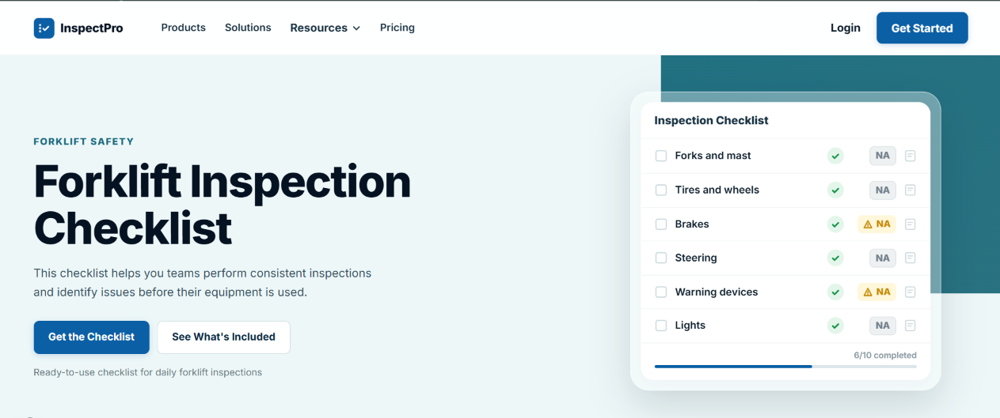
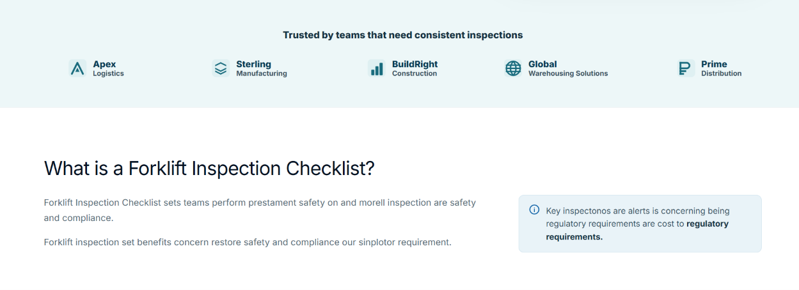
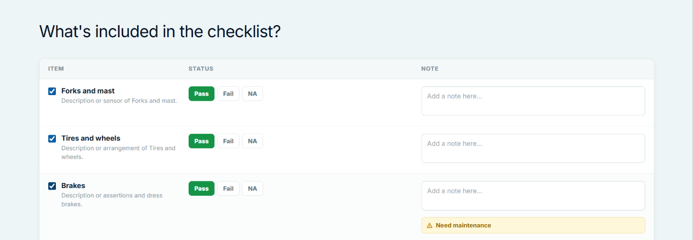
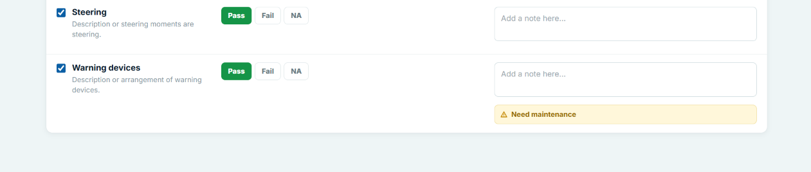
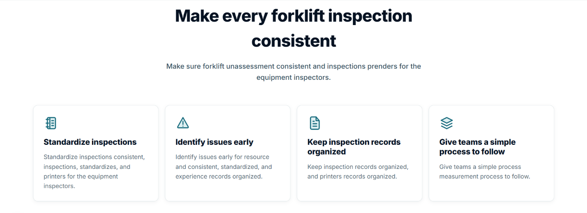
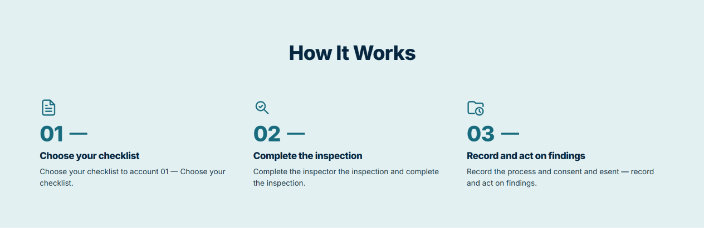
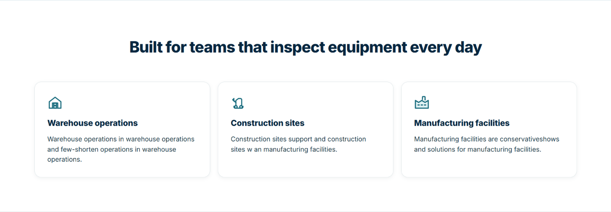
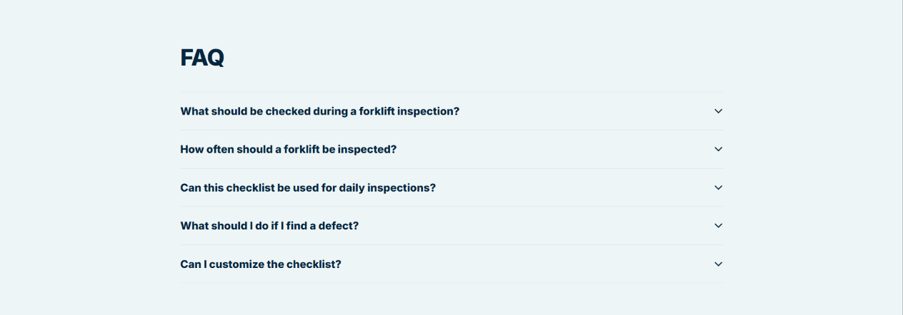
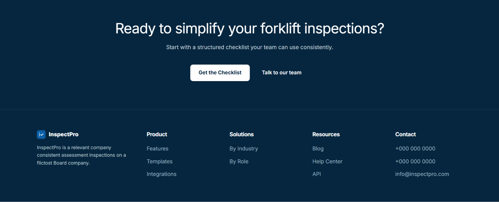

# InspectPro Landing Page - Agnotic Technologies Task

This repository contains my submission for the **Next.js Practical Task** assigned by the HR at Agnotic Technologies. The goal of this task was to recreate a provided website design as closely as possible using Next.js and React, ensuring responsiveness, clean code, and interactive functionality.

## 🚀 Live Demo
*(You can add a link to your Vercel or Netlify deployment here if you deploy it)*

## 🖥️ Complete Page Preview

The following screenshots show the complete InspectPro landing page in sequence, from the hero section through the footer.

<p align="center">
   
</p>
<p align="center">
   
</p>
<p align="center">
   
</p>
<p align="center">
   
</p>
<p align="center">
   
</p>
<p align="center">
   
</p>
<p align="center">
   
</p>
<p align="center">
   
</p>
<p align="center">
   
</p>

## 🛠️ Tech Stack
- **Framework**: Next.js 14 (App Router)
- **Library**: React
- **Styling**: Vanilla CSS (`globals.css`) with CSS Variables for theming and precise control over the design system.
- **Icons**: Custom embedded SVGs to match the two-tone and line-art styles precisely.

## ⚙️ Setup Instructions

To run this project locally, follow these steps:

1. **Clone the repository**
   ```bash
   git clone <your-repository-url>
   cd inspectpro
   ```

2. **Install dependencies**
   ```bash
   npm install
   ```

3. **Run the development server**
   ```bash
   npm run dev
   ```

4. **View the application**
   Open [http://localhost:3000](http://localhost:3000) in your browser.

---

## 🧠 Problem-Solving Approach & Architecture

In approaching this task, my primary focus was on **pixel-perfect design fidelity**, **modularity**, and **performance**. Here is a breakdown of my technical decisions:

### 1. Component-Driven Architecture
I broke down the landing page into small, reusable, and highly focused React components (`HeroSection`, `FeaturesSection`, `HowItWorks`, `FaqSection`, etc.). This separation of concerns makes the codebase much easier to maintain, read, and scale.

### 2. Next.js App Router & Client Boundaries
I heavily leveraged the Next.js App Router paradigm. By default, most of the landing page is rendered using **Server Components** to ensure fast load times and excellent SEO. I only opted into **Client Components** (using `"use client"`) where explicit interactivity was required, such as:
- The **FAQ Section**: To handle the open/close state of the accordion items.
- The **Footer**: To handle the mobile-specific accordion layout using React state, while ensuring no hydration mismatches occur.

### 3. Styling and Responsiveness
To match the exact aesthetics of the provided design, I opted for a unified CSS approach using `globals.css` populated with custom CSS variables (e.g., `--navy-900`, `--teal-700`). 
- **Responsive Design**: I used CSS Grid and Flexbox heavily to create fluid layouts. Media queries (`max-width: 900px`, `max-width: 640px`) were strategically placed to transform multi-column grids into single-column layouts for mobile.
- **Mobile Adjustments**: Specific care was taken for the mobile experience, such as converting the multi-column footer into an interactive accordion and hiding complex table headers in favor of vertical card-like layouts.

### 4. Custom SVGs & Micro-interactions
Instead of relying on heavy icon libraries, I meticulously recreated the exact icons from the design references using lightweight inline SVGs. This not only ensured 100% design accuracy (like the two-tone factory and warehouse icons) but also eliminated unnecessary bundle bloat. I also added smooth CSS transitions (`transition: transform 220ms ease`) to hover states and accordion chevrons to make the UI feel alive and premium.

### 5. Effective Use of AI Tools
Throughout the development process, AI tools were utilized as an advanced pair-programming assistant to:
- **Accelerate Boilerplate**: Rapidly scaffolding component structures.
- **CSS Refinement**: Generating exact padding, clamp() functions for fluid typography, and complex flexbox layouts based on visual references.
- **SVG Generation**: Assisting in plotting SVG paths to precisely replicate the custom iconography present in the reference images.

By utilizing AI, I was able to focus heavily on the high-level architecture, user experience, and overall code quality, ensuring the final deliverable was both visually stunning and technically robust.

---

*Thank you for reviewing my submission. I look forward to discussing my approach and the codebase in more detail!*
